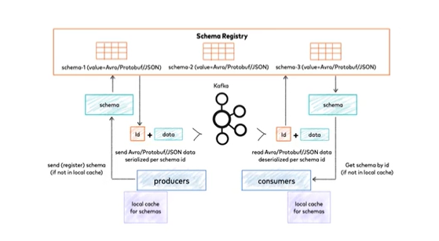

## Introdução ao Apache Kafka
* Introdução
* O que é Mensageria
* Qual problema a mensageria resolve
* Introdução ao Apache Kafka
* Arquitetura do Apache Kafka
* O que e um tópico?
* O que é uma partição?
* O que são offsets?
* O que é um produtor?
* O que é um consumidor?
* O que são grupos de consumidores?
* O que é Apache Zookeeper?
* O que é KIP-500
* Comparação Apache Kafka vs RabbitMQ
* Teste os seus conhecimentos

## Hands-On
* Criar um tópico
  ```powershell
  --create --topic nome-do-topico --bootstrap-server localhost:9094
  ```
* Listar tópicos do Apache Kafka
  ```powershell
  --list --bootstrap-server localhost:9094
  ```  
* Excluir tópico
  ```powershell
  --delete --topic nome-do-topico --bootstrap-server localhost:9094
  ``` 
* Criar tópico com várias partições
  ```powershell
  --create --topic nome-do-topico --bootstrap-server localhost:9094 --partitions 2 --replication-factor 2
  ```
* Alterar quantidade de partições
  ```powershell
  --alter --topic nome-do-topico --bootstrap-server localhost:9094 --partitions 3 
  ```
* Obter informações de um tópico
  ```powershell
  --describe --topic nome-do-topico --bootstrap-server localhost:9094
  ```
* Produzir mensagens
```powershell
  kafka-console-producer.bat --topic chat --bootstrap-server lotalhost:9094

  >Mensagem teste 1
  >Mensagem teste 2
```
* Consumir mensagens
```powershell
  kafka-console-consumer.bat --topic chat --bootstrap-server lotalhost:9094
  kafka-console-consumer.bat --topic chat --bootstrap-server lotalhost:9094 --from-beginning
  kafka-console-consumer.bat --topic chat --bootstrap-server lotalhost:9094 --from-beginning  --property print.partition=true --property print.offset=true
```
* Consumir mensagens em grupos de consumidores
```powershell
  kafka-console-consumer.bat --topic chat --bootstrap-server lotalhost:9094 --from-beginning  --property print.partition=true --property print.offset=true --group grupo1

  kafka-console-consumer.bat --topic chat --bootstrap-server lotalhost:9094 --from-beginning  --property print.partition=true --property print.offset=true --group grupo2  
```
## Schema Registry
* Introdução
* O que é Schema Registry
* Instalando centro de controle da Confluent
  * https://docs.confluent.io/platform/current/quickstart/ce-docker-quickstart.html
  ```bash
  docker compose -f docker-compose-confluent.yml up -d
  ```
* Criando um projeto produtor e consumidor
  ```powershell
    dotnet new sln -n Desenvolvedor.IO
    dotnet new console -n Produtor
    dotnet add Produtor package Confluent.Kafka --version 1.8.2
    dotnet new console -n Consumidor
    dotnet add Consumidor package Confluent.Kafka --version 1.8.2
    dotnet sln add Produtor
    dotnet sln add Consumidor
    dotnet build
    
  ```
* Implementando um produtor e um consumidor

* Instalando Tools do Apache Avro
```csharp
  dotnet tool install --global Apache.Avro.Tools
  dotnet add Produtor package Confluent.SchemaRegistry.Serdes.Avro
  dotnet add Consumidor package Confluent.SchemaRegistry.Serdes.Avro
```
* Criando um Schema

```csharp
  avrogen -s ..\Avros\Curso.avsc

```

* Implementando Schema Registry
* Teste os seus conhecimentos

## Implementação no DevStore
* Clonar o projeto
* Executar o projeto no Docker
* Executar projeto no Visual Studio
* Implementar produtor e consumidor no devStore
* Corrigir os problemas de migração
* Testar o fluxo do devStore

## Kafka Avançado
## Encerramento

## Links
https://kafka.apache.org/
https://docs.confluent.io/platform/current/platform-quickstart.html
https://avro.apache.org


